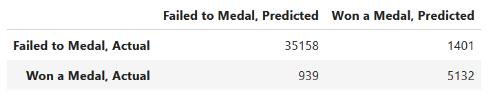

# GROUP PROJECT

## OVERVIEW

This document serves as a high-level summary of the project, including the project description, data resources, presentation and status. 

### PRESENTATION

**Topic**

Data Science & Analytics Capstone Project Topic: Olympic Medaling

**Reason for Selection**

The team reviewed and discussed 3 potential topics.  After exploring multiple datasets and considering the pros and cons of each, we decided to pursue Olympic Medaling. Collectively, we believed this dataset offered the most opportunity to demonstrate existing skills and expand our knowledge to test each theory.  After further conversation with our instructor, we decided to push ourselves beyond the economic factors and demographics and have incorporated analytics that will also focus on Olympic athlete data.

**Description of Data Source**

To date, we have found numerous sources to collect the following information:
- Olympic game data
- Country economic factors (GDP) and demographics (population)
- Olympic athletes bio and physical attributes

The process of cleansing data for utilization has now been completed.  

Datasets in original and cleansed format may be found within the [Resources folder](https://github.com/FrankPassalacqua88/Olympic_Data_Analysis/tree/main/Resources).  

A list of references from where the original data was sourced is available via the [Resource Hyperlinks](https://github.com/FrankPassalacqua88/Olympic_Data_Analysis/blob/4bf8de5c99385051b0ad16081716bf3c53ba59b7/Resources/Hyperlinks/Resource_Hyperlinks.docx).

**Questions to be Answered**
1. Is there a correlation between a country's economic factors (GDP), demographics (population) and medal count?
2. Can we predict, based on an athlete's physical attributes and team (country), whether they'll place a medal?
3. Can the model determine if a hypothetical althlete would win?

**Description of Data Exploration**

WILL TO COMPLETE

**Description of the Analysis Phase**

To determine whether there is a correlation between the population, GDP and medal count, we gathered the country’s stats from 1960 to 2020 and created a choropleth map utilizing Plotly’s template. We also included an overlay for scatter plots representing accumulated medal wins. As an interactive component that also serves as a story-telling, we included an animation frame demonstrating the world’s growth year after year. To further drive our findings, we included a rankings list of countries with top GDP and Population compared to their medal score. 
 
The population map shows China and India leading in size, however, this is not the case  for medal scores.  India being the second leading population has a very low medal score. From our analysis, we concluded that population size does not influence medal wins. 

The GDP map tells a different story.  From the rankings list, we can see the US leading in GDP as well as medal scores for 2020. GDP and medal wins are followed by China, Japan and UK which shows a strong correlation between GDP and medal scores. Looking at each Summer event per year, we came to the same conclusion. 

Diving deeper into our analysis, we wanted see how a particular country stacked up to the rest of the world. With the data we gathered on population, GDP, GDP per capita and medal scores, we created a normalized graph from 1960 to 2020. As we saw in the choropleth map above, we know the US is the leading country in GDP with 2020 being the largest at $21 trillion. From the below, this is further confirmed with 2020 being at the max 1 value. 

Similar with China, we see their largest population status confirmed and we also see around 2004 their GDP begins to rapidly climb.  

We also took a look at Australia. Although their GDP is lower, they outperformed based on their medal score. We can see, in relation to it's populaton and GDP, this country has a strong GDP Per Capita score. 

### TOOLS

Github, other - 

LAURA TO COMPLETE

### MACHINE LEARNING MODEL

In order to create a high accuracy machine learning model ten features were chosen from the data set. The features selected are age, sex, height, weight, year the event was held, if the event is a team sport, GDP, GDP per capita, precent of world population, and population. These features were selected because they are likely important factors that determines an athlete’s success. Each individual factor falls into one of two categories: physical attributes or environmental factors. The age, height, sex, and weight factors were chosen to define the physical attribute, and the remainder of the model’s factors fall into environmental factors.

To create this dataframe of features the data was merged from four tables (See “Description of Data Source” for more details regarding the data’s origin). The “percent of world population” and “GDP” columns were calculated from existing dataset. Early Olympic events have major gaps in record keeping as well as a lack of recording of environmental factors. Only athletes with complete data sets were used for training the model. Sports with less than 1000 records after the aforementioned preprocessing were not modeled to avoid overfitting.

The target column, medals, was mapped to either be a “1” for winning a medal or “0” for failing to medal. The data was split into test and training sets using scikit-learn’s “train_test_split”. Due the large discrepancy between the athletes that did and did not win a medal “RandomOverSampler” was used to even out the training data set. The “RandomForestClassifier” model was chosen due to its high accuracy. Improvements over the previous iteration of the model included the addition of the GDP per capita and precent of world population factors. A model was created for each individual sport as the ideal physical and environmental factors likely differ across sports. 

The confusion matrix and classification report are shown below. The confusion matrix shows a very low rate of false positives. The precision, recall, and f1-score for predicting if an athlete would fail to medal were .97, .96, and .97 respectively.  Predicting if an athlete succeeded in medaling was more difficult for the model with the precision, recall, and f1-score of .79, .85, and .81 respectively. The lower precision, recall, and f1-score when predicting if an athlete succeeded in medaling is a good sign the model is not over trained to find medaling athletes. 

Confusion Matrix:

Classification Report:

A link to the model can be found here: [Machine Learning Model](https://github.com/FrankPassalacqua88/Olympic_Data_Analysis/blob/d011f619eddb42940fc4c106471e63a7da366733/fp/RandomForest-MedalPredictor.ipynb)

FRANK TO COMPLETE

### DATABASE 

The final machine learning model and dashboard will primarily pull data in from cleansed CSV files.  After the datasets were located and exported, the team evaluated how each of the components of data related to one another via an [ERD](https://github.com/FrankPassalacqua88/Olympic_Data_Analysis/blob/097e394fb11aaeb831c7b5a3930cc990cdd31402/images/ERD.png) and suggestions to cleanse and improve the data was discussed.  The cleansing was accomplished via Jupyter Notebook and Pandas and examples of how the data has been cleansed can be viewed via the below links:

1. [Cleaning Data File 1](https://github.com/FrankPassalacqua88/Olympic_Data_Analysis/blob/42d9fbe2bd781425c091011fd1685999287671fa/wpf/Cleaning.ipynb)
2. [Cleaning Data File 2](https://github.com/FrankPassalacqua88/Olympic_Data_Analysis/blob/42d9fbe2bd781425c091011fd1685999287671fa/wpf/Cleaning2.ipynb)
3. [Cleaning Data File 3](https://github.com/FrankPassalacqua88/Olympic_Data_Analysis/blob/b93ee9b55bb98d825a0c2eb33b12fb89544c7920/wpf/Cleaning3.ipynb)

Once the files were ready they were utilized to create multiple charts and have also been connected to the provisional machine learning model.
LAURA TO REVISE WITH FINAL LINKS UPON REPOSITIORY CLEANUP

### DASHBOARD

After preliminary discussion, we believed we would utilize an html website to deliver the final presentation.  After additional discussion and research, we are now segwaying to test code using Panel as the dashboard.  We do have preliminary working models, however, in each instance we have hurdles to overcome to achieve full functionality.  For example, the widgets are not properly interactiving with the charts, or the team is unsatisfied with the dashboard layout.  There is much more to learn and achieve here prior to completion. To date we have achieved the following DRAFTS: 

- [x] Created a visual dashboard storyboard, available on Google Slides:  [Dashboard](https://1drv.ms/p/s!AsgKvHxaT8bpmChrwYOLs8rwNU-l?e=STcr98)
- [x] Can describe the tools that will be used to create the final dashboard, as seen on the storyboard and achieved via usage of the following: 
    1. Jupiter Notebook to house code
    2. Libraries including: Pandas, Hvplot, RandomForest, etc.
    3. Panel to be used for the dashboard
- [x] Final location of interactive elements are a work in progress but the goal is to include dropdown menus and animation frames that provide time lapses over portions of the data
LAURA TO UPDATE UPON DASHBOARD COMPLETION
______________________________________________________________________________________________
# Below for Reference - DOCUMENT A WIP

**Description of Data Exploration**

The data exploration phase required that each member of the team roll up their sleeves and become acquainted with the data.  As we became familiar with our different sources, it became clear that certain files would be more beneficial than others to each of our individual tasks.  Although it had been cleansed, as we began to work with the data individually we also realized the data may have required additional modification, data merge or additional calculation to achieve those tasks.

**Description of the Analysis Phase**

During the analysis phase of the project the team began by discussing the ideas we had for the questions we wanted to answer.  We then attempted to mock up what tools, data and outputs we'd be seeking to achieve.  Thru trial and error on code, correction and modification to code, and by listening to the feedback of the fellow team members we continued to see progress daily. 

**Google Slides**

A draft version of the presentation is available in Google Slides: [Presentation](https://1drv.ms/p/s!AsgKvHxaT8bpmC03mzbFumuZ0agN?e=F3RH36)

### GitHub

The team has created a Github to house the project as we complete each milestone that includes the following:
- [x] A README.md to track progress status and final deliverable
- [x] A Resources folder to house all data (draft and cleansed)
- [x] An Admin folder to house meeting notes and agenda topics
- [x] An Images folder for the ERD and future graphics
- [x] Individual member folders for draft code
- [x] Folder for Final Dashboard and Presentation
- [ ] WIP - Additional files/folders to be discussed as needed

Additionally, the team has a rolling cycle of determining if/when meetings are needed and are actively utilizing slack and dedicated class time to communicate. Recap of the meeting schedule (to date) is below.
- [x] 2/23 - Initial meeting to discuss potential topics (Olympic data, Lottery, Food Stores) 
- [x] 2/27 - Finalize topic (Olympic data)
- [x] 2/28 - Class; enhance topic to include athlete bio data
- [x] 3/01 - Class; discuss Random Forest as machine learning model and assign team tasks
- [x] 3/05 - Check-in to review progress of each task
- [x] 3/06 - Subset meeting to discuss data intro
- [x] 3/07 - Class; round table to discuss status and address any issues
- [x] 3/09 - Class; round table to review chart status and initial RandomForest modeling results
- [x] 3/14 - Class; issue resolution and Panel dashboard discussion
- [x] 3/16 - Class; continue issue resolution and Panel dashboard to do's
- [ ] 3/18 - Continue issue resolution and Panel dashboard to do's

A list of team tasks has been documented and can be viewed here: [Team Notes](https://github.com/FrankPassalacqua88/Olympic_Data_Analysis/blob/4bf8de5c99385051b0ad16081716bf3c53ba59b7/Admin/Team_Notes.docx)

