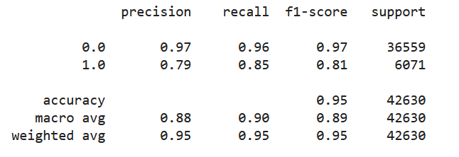

# GROUP PROJECT

## OVERVIEW

This document serves as a high-level summary of the project, including the project description, data resources, presentation and dashboard.

### PRESENTATION

**Topic**

Data Science & Analytics Capstone Project Topic: Olympic Medaling

**Reason for Selection**

The team reviewed and discussed 3 potential topics.  After exploring multiple datasets and considering the pros and cons of each, we decided to pursue Olympic Medaling. Collectively, we believed this dataset offered the most opportunity to demonstrate existing skills and expand our knowledge to test each theory.  After further conversation with our instructor, we decided to push ourselves beyond the economic factors and demographics and have incorporated analytics that will also focus on Olympic athlete data.

**Description of Data Source and Link to Database**

To date, we have found numerous sources to collect the following information:
- Olympic game data
- Country economic factors (GDP) and demographics (population)
- Olympic athletes bio and physical attributes

Datasets in original and cleansed format may be found within the [Resources folder](https://github.com/FrankPassalacqua88/Olympic_Data_Analysis/tree/main/Resources).  

A list of references from where the original data was sourced is available via the [Resource Hyperlinks](https://github.com/FrankPassalacqua88/Olympic_Data_Analysis/blob/4bf8de5c99385051b0ad16081716bf3c53ba59b7/Resources/Hyperlinks/Resource_Hyperlinks.docx).

**Questions to be Answered**
1. Is there a correlation between a country's economic factors (GDP), demographics (population) and medal count?
2. Can we predict, based on an athlete's physical attributes and team (country), whether they'll place a medal?
3. Can the model determine if a hypothetical althlete would win?

**Description of Data Exploration**

Below is a summary of our key data exploration steps:


After the datasets were located and exported, the team evaluated how each of the components of data related to one another via an [ERD](https://github.com/FrankPassalacqua88/Olympic_Data_Analysis/blob/097e394fb11aaeb831c7b5a3930cc990cdd31402/images/ERD.png) and suggestions to cleanse and improve the data was discussed.

When we were initially gathering data for this analysis we were quick to find datasets about country GDPs, populations, medal counts, and Olympic athelte bios. We soon learned that, while easy to find, answering the questions we raised required some finessing of the data.  

As an example, one of the parameters needed for questions two and three was age. The problem was the dataframe with most of the athelte info only had the birthdate (Year, Month, Day), not their age when they performed at the Olympics. However, another dataframe, without their birthdate, did provide the year they performed at the Olympics. Using the Python libray Pandas, here are the initial steps taken to determine the ages of the athletes:

1.  Using the `split` function on the birthdate to turn it into a list.
2.  Creating a new dataframe from the list and using the `tolist` function on it to separate them into new columns,then dropping the Month and Day columns whilst keeping the Year column.
3. `Concatenating` the two dataframes together. 

A separate dataframe containing the year the atheltes performed at the Olympics was then read in. After repeating steps 1-3 for this dataframe on the year column, it was finally time to find the age of the athletes. The code to find it is as follows: 

```
merge_df = pd.merge(df1,df2, on = 'Athlete_ID')

merge_df['Birth_Year'] = pd.to_numeric(merge_df['Birth_Year'], errors = 'coerce')

merge_df['Year'] = merge_df['Year'].astype('int64', errors = 'ignore')

merge_df['Age'] = merge_df['Year'] - merge_df['Birth_Year'] 
```

These lines of code tell the two dataframes to merge together on a specified column(`Athlete_ID`). Then, since columns `Birth_Year` and `Year` were strings due to the `split` function, they needed to be converted to integers using the `to_numeric` and `astype` functions, respectively. Since some of the rows had 'N/A' string values, errors had to be either coerced or ignored to run the code properly. Finally, a new column named `Age` was created and filled with values by subtracting the `Birth_Year` column from the `Year` column. Now every athlete that had their birthdate information had their age for when they participated at the Olympics.

After the data was transformed and cleaned, we set about creating visualizations from these datasets through graphs, images, and videos. The visualizations were made with the intention of showing the outcomes to our questions and provide extra insights into what we found in the data.  

**Description of the Analysis Phase**

To determine whether there is a correlation between the population, GDP and medal count, we gathered the country’s stats from 1960 to 2020 and created a choropleth map utilizing Plotly’s template. We also included an overlay for scatter plots representing accumulated medal wins. As an interactive component that also serves as a story-telling, we included an animation frame demonstrating the world’s growth year after year. To further drive our findings, we included a rankings list of countries with top GDP and Population compared to their medal score. 
 
The population map shows China and India leading in size, however, this is not the case  for medal scores.  India being the second leading population has a very low medal score. From our analysis, we concluded that population size does not influence medal wins. 


The GDP map tells a different story.  From the rankings list, we can see the US leading in GDP as well as medal scores for 2020. GDP and medal wins are followed by China, Japan and UK which shows a strong correlation between GDP and medal scores. Looking at each Summer event per year, we came to the same conclusion. 


Diving deeper into our analysis, we wanted see how a particular country stacked up to the rest of the world. With the data we gathered on population, GDP, GDP per capita and medal scores, we created a normalized graph from 1960 to 2020. As we saw in the choropleth map above, we know the US is the leading country in GDP with 2020 being the largest at $21 trillion. From the below, this is further confirmed with 2020 being at the max 1 value. 


Similar with China, we see their largest population status confirmed and we also see around 2004 their GDP begins to rapidly climb.  


We also took a look at Australia. Although their GDP is lower, they outperformed based on their medal score. We can see, in relation to it's populaton and GDP, this country has a strong GDP Per Capita score. 


### TOOLS

A list of the tools primarily used to complete the project are included below:


### MACHINE LEARNING MODEL

In order to create a high accuracy machine learning model ten features were chosen from the data set. The features selected are age, sex, height, weight, year the event was held, if the event is a team sport, GDP, GDP per capita, precent of world population, and population. These features were selected because they are likely important factors that determines an athlete’s success. Each individual factor falls into one of two categories: physical attributes or environmental factors. The age, height, sex, and weight factors were chosen to define the physical attribute, and the remainder of the model’s factors fall into environmental factors.

To create this dataframe of features the data was merged from four tables (See “Description of Data Source” for more details regarding the data’s origin). The “percent of world population” and “GDP” columns were calculated from existing dataset. Early Olympic events have major gaps in record keeping as well as a lack of recording of environmental factors. Only athletes with complete data sets were used for training the model. Sports with less than 1000 records after the aforementioned preprocessing were not modeled to avoid overfitting.

The target column, medals, was mapped to either be a “1” for winning a medal or “0” for failing to medal. The data was split into test and training sets using scikit-learn’s “train_test_split”. Due the large discrepancy between the athletes that did and did not win a medal “RandomOverSampler” was used to even out the training data set. The “RandomForestClassifier” model was chosen due to its high accuracy. Improvements over the previous iteration of the model included the addition of the GDP per capita and precent of world population factors. A model was created for each individual sport as the ideal physical and environmental factors likely differ across sports. 

The confusion matrix and classification report are shown below. The confusion matrix shows a very low rate of false positives. The precision, recall, and f1-score for predicting if an athlete would fail to medal were .97, .96, and .97 respectively.  Predicting if an athlete succeeded in medaling was more difficult for the model with the precision, recall, and f1-score of .79, .85, and .81 respectively. The lower precision, recall, and f1-score when predicting if an athlete succeeded in medaling is a good sign the model is not over trained to find medaling athletes. 

Confusion Matrix:


Classification Report:



A link to the model can be found here: [Machine Learning Model](Mech_Learning/RandomForest-MedalPredictor.ipynb)


### DASHBOARD

Panel Dashboard was utilized to store our interactive graphs and charts.  This included a sidebar toggle with dropdown navigation and a description of each tab.

The first two tabs, Seasons & Athlete Bio's, are from our initial analysis and learning the data.  The World Map and Country Stat tabs were used in answering question 1. Is there a correlation between a country's economic factors (GDP), demographics (population) and medal count?  Lastly, the Predictions tab includes a summary of the Feature Importances by Sport and a summary Classification report from our Machine Learning Model.


### RECOMMENDATIONS FOR FUTURE ANALYSIS

While the team successfully completed our objectives there are things we learned worked well, and also areas for improvment.

What worked well?
- Developing test models
- Levaraging each other's expertise

Future enhancements:
- Improved comprehension of dashboard tools and library compatibility
- Utilization of Github branches and merging

### SUMMARY
- [x] Succeeded in answering 3 critical questions pertaining to Olympic medaling
- [x] Developed proficiency in multiple tools including Jupyter Notebook, Python, Scikit-learn, Plotly and Panel Dashboard
- [x] Concluded efforts with a 12 minute [Presentation](https://1drv.ms/p/s!AsgKvHxaT8bpmDdv6SE6EDmZUu5Z?e=LfMsh8) and an interactive live demo of the [Dashboard](https://github.com/FrankPassalacqua88/Olympic_Data_Analysis/blob/main/Dashboard/Dashboard_Demo.mp4).


